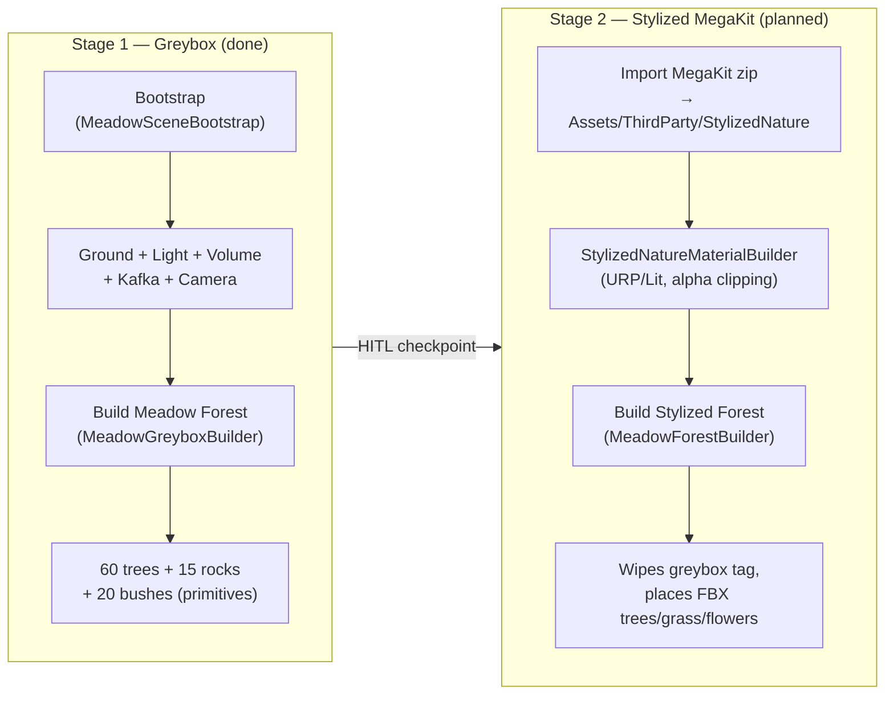
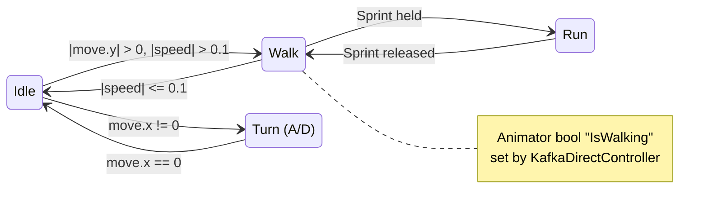

# Meadow Forest Sandbox

Sandbox-сцена `Scene_MeadowForest_Greybox.unity`: большая полянка 80×80м с лесом ~60 деревьев, по которой бегает **Кафка** под прямым управлением WASD. Третье лицо, Cinemachine FreeLook.

**Не интегрируется** в Episode 0 — это отдельный полигон для прототипирования окружения, и в будущем — для замены greybox-примитивов на ассеты из **Stylized Nature MegaKit** (Quaternius).

- **Status:** Sprint 0–4 реализованы (код). Requires Unity Editor to execute bootstrap.
- **Scope:** sandbox, вне `EditorBuildSettings.scenes`.
- **Scene:** `Assets/_Project/Scenes/Scene_MeadowForest_Greybox.unity`

## Пайплайн



## Control scheme



- **W/S** — forward / back (`transform.forward * speed`)
- **A/D** — turn around Y (`transform.Rotate(0, turn, 0)`)
- **Shift** — sprint (2.5 m/s → 5.0 m/s)
- **RMB + Mouse** — orbit camera (Cinemachine FreeLook rides Mouse X/Y; fallback `KafkaFollowCamera` uses RMB only)

## Файлы

| Файл | Роль |
|---|---|
| `Assets/_Project/Scripts/Kafka/KafkaDirectController.cs` | Runtime. WASD → CharacterController.Move + Animator.IsWalking. Использует `AfterhumansInputWrapper` (new Input System). |
| `Assets/_Project/Scripts/Camera/KafkaFollowCamera.cs` | Runtime fallback. Spring-arm follow camera на случай если Cinemachine FreeLook даёт проблемы. Выключен по умолчанию, рядом с `CinemachineBrain` на Main Camera. |
| `Assets/_Project/Editor/MeadowSceneBootstrap.cs` | Editor. Menu `Afterhumans/Meadow/Bootstrap Sandbox Scene` — создаёт сцену целиком: ground + свет + fog + ambient + Kafka (FBX + Animator + CharacterController + KafkaDirectController) + Cinemachine FreeLook + Volume (копия VP_Botanika). Не добавляет в Build Settings. |
| `Assets/_Project/Editor/MeadowGreyboxBuilder.cs` | Editor. Menu `Afterhumans/Greybox/Build Meadow Forest` — процедурно расставляет 60 trees / 15 rocks / 20 bushes (seeded random 42), тэгирует `MeadowGreybox`. Menu `…/Wipe Meadow Greybox` сносит всё. |
| `Assets/_Project/Materials/Nature/Mat_Meadow_Greybox.mat` | Создаётся bootstrap'ом. URP/Lit `#7BA05B`. |
| `Assets/_Project/Materials/Nature/Mat_Tree_Trunk_Greybox.mat` | Создаётся builder'ом. URP/Lit dark brown. |
| `Assets/_Project/Materials/Nature/Mat_Tree_Crown_Greybox.mat` | URP/Lit deep green. |
| `Assets/_Project/Materials/Nature/Mat_Rock_Greybox.mat` | URP/Lit neutral grey. |
| `Assets/_Project/Materials/Nature/Mat_Bush_Greybox.mat` | URP/Lit sage green. |
| `Assets/_Project/Settings/URP/VolumeProfiles/VP_MeadowForest.asset` | Копия `VP_Botanika.asset`. Можно потом затюнить fog/bloom/vignette отдельно для полянки. |

## Как запустить (Unity Editor)

1. Открыть проект в Unity 6 (`6000.0.72f1`).
2. Дождаться компиляции скриптов (проверить Console — должно быть 0 errors).
3. Меню: `Afterhumans → Meadow → Bootstrap Sandbox Scene`
   - Создаст `Scene_MeadowForest_Greybox.unity` + материалы + Volume profile.
   - Сцена откроется автоматически.
4. Меню: `Afterhumans → Greybox → Build Meadow Forest`
   - Расставит trees/rocks/bushes в текущей сцене (seeded random, повторяемо).
5. Press **Play** → WASD двигает Кафку, Shift бежит, мышь крутит камеру.

**Iterate greybox:** можно вызывать `Build Meadow Forest` сколько угодно — builder сначала сносит старый `Meadow_Greybox_Root`, потом создаёт новый. Для изменения seed или плотности — правь константы в `MeadowGreyboxBuilder.cs`.

## Как запустить (Unity CLI — если Editor не открыт)

```bash
UNITY=/Applications/Unity/Hub/Editor/6000.0.72f1/Unity.app/Contents/MacOS/Unity
"$UNITY" -batchmode -nographics -quit \
  -projectPath ~/afterhumans \
  -executeMethod Afterhumans.EditorTools.MeadowSceneBootstrap.Bootstrap \
  -logFile /dev/stdout
```

(Builder пока не CLI-entry-point. Если нужно — добавим `[MenuItem]`-free wrapper.)

## Планируемые апгрейды (Sprint 6–8)

1. **Sprint 6** — распаковать `~/Downloads/Stylized Nature MegaKit[Standard].zip` в `Assets/ThirdParty/StylizedNature/`, написать `StylizedNatureMaterialBuilder.cs` который делает ~15 URP/Lit материалов (bark ×3, leaves ×5 с alpha clipping, grass, rocks ×2, flowers ×2, mushrooms). Smoothness 0.1 / Metallic 0 — стилизация, не PBR.
2. **Sprint 7** — `MeadowForestBuilder.cs` использует тот же seed (42), сносит `Meadow_Greybox_Root`, расставляет FBX-префабы вместо примитивов. 60 trees (mix CommonTree / Pine / DeadTree / TwistedTree), 15 Rock_Medium, 120 grass patches, 40 flowers, 15 ferns, 8 mushroom clusters, 20 bushes.
3. **Sprint 8** — Volume profile tuning (fog green-blue, Bloom 0.3, Vignette 0.25, Color Adjustments warm), опциональный HDRI skybox из Poly Haven, ambient wind/birds SFX.

**HITL checkpoint** после Sprint 5: показать Тиму greybox .app → получить ок на замену примитивов на MegaKit.

## Troubleshooting

| Симптом | Причина / Фикс |
|---|---|
| Compile error: `CinemachineFreeLook` not found | Пакет `com.unity.cinemachine@2.10.7` есть в `Packages/manifest.json`, но Unity Editor ещё не импортировал. Решение: открыть Editor, подождать, проверить `Packages/` в Project окне. |
| Кафка парит над землёй | Проверить в префабе FBX: Animator Rig → Generic, Scale = 1. CharacterController `center.y` должен = ~половина высоты модели. |
| Листья (после Sprint 6) — непрозрачные квадраты | URP/Lit материал: включить Alpha Clipping + Threshold 0.2. MegaKit glTF сам хранит alphaMode MASK с cutoff 0.2 — наши материалы должны это повторить. |
| FPS < 30 на M1 8GB с MegaKit лесом | Отключить realtime shadows на trees (static batching справится). Увеличить camera far clip cull до 80m. Включить GPU Instancing в материалах. |
| Cinemachine FreeLook не реагирует на мышь | Axis binding = `Mouse X` / `Mouse Y` — legacy Input Manager. В новом Input System эти названия существуют по дефолту. Если нет — переключить на custom axis в FreeLook Axis Control. |

## Риски / решения

| Риск | Mitigation |
|---|---|
| MegaKit Standard не включает URP материалы | Пишем материалы сами через `StylizedNatureMaterialBuilder`. Текстуры albedo + normal — используем (smoothness/metallic не из паков). |
| M1 8GB + 60 FBX-деревьев без LOD | Static batching, отключить realtime shadows на деревьях, aggressive culling distance 60–80m. |
| `KafkaFollow.cs` (companion) случайно активируется в sandbox | Bootstrap не добавляет `KafkaFollowSimple`/`KafkaFollow` на Kafka. Только `KafkaDirectController` (явно «player, not companion»). |
| Cinemachine FreeLook ломается на осях | Запасной `KafkaFollowCamera.cs` лежит disabled на Main Camera — включить один чекбокс, выключить `CinemachineBrain`. |

## См. также

- `docs/PLAN.md` — глобальный roadmap Episode 0 (Botanika/City/Desert)
- `docs/ART_BIBLE.md` — палитра и tone-of-voice (для финального стилизованного вида)
- Плейс файла: https://github.com/TimmyZinin/afterhumans/tree/main/docs
